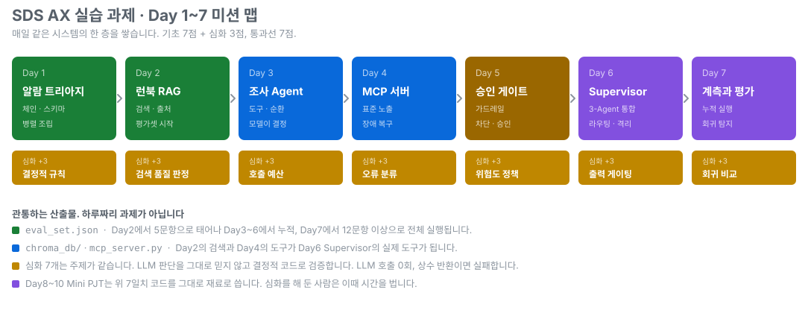

# SDS AX 실습 과제 저장소

> Day 1~7 실습 과제와 자동 채점. 매일 같은 시스템에 한 층씩 쌓아 올립니다.

  

## Day별 미션 안내서

Day를 누르면 그날의 미션과 요구사항, 채점 기준표로 바로 갑니다.

| Day | 미션 | 기초 파트에서 만드는 것 | 심화 파트 (+3) |
|:---:|---|---|---|
| **[Day 1](day01/README.md)** | 운영 알람 트리아지 체인   알람 하나 → 구조화 분류 + 안내 초안 | `TRIAGE_SCHEMA` · `build_triage_chain`   `build_notice_chain` · `build_full_chain` | `apply_severity_rules`   LLM 판단 위에 결정적 규칙 |
| **[Day 2](day02/README.md)** | 런북 RAG와 평가셋   근거(출처)와 함께 답하기 | `build_chunks` · `build_retriever`   `build_rag_chain` · `eval_set.json` 5문항 | `assess_retrieval`   못 쓸 검색이면 모델을 안 부름 |
| **[Day 3](day03/README.md)** | 장애 원인 조사 Agent   모델이 다음 행동을 스스로 결정 | `TOOLS` (조회, 계산, 판단형)   `build_agent`, 순환 그래프 | `MAX_TOOL_CALLS` · `should_stop`   호출 예산과 조기 종료 |
| **[Day 4](day04/README.md)** | 운영 지원 MCP 서버와 장애 복구   표준 프로토콜로 노출 + 실패 복구 | `TOOL_SPECS` · `TOOLS_IMPL`   `get_asset_status` · `day04/mcp_server.py` | `classify_failure`   retryable / backoff / fatal 분기 |
| **[Day 5](day05/README.md)** | 승인 게이트와 가드레일   위험한 요청 차단, 되돌릴 수 없으면 승인 | `input_guard` · `mask_pii`   `MIDDLEWARE_ORDER` | `RISK_LEVELS` · `needs_approval`   위험도별 승인 정책 |
| **[Day 6](day06/README.md)** | Supervisor 인시던트 대응팀   Day2 검색 + Day4 도구를 한 시스템으로 | `AGENT_NAMES` · `AGENT_TOOLS`   `route_question` · `build_supervisor` | `judge_output`   저가치·근거 없는 단정 억제 |
| **[Day 7](day07/README.md)** | 계측과 누적 평가   Day2에 심은 문항을 여기서 회수 | `TraceCollector` · `run_eval`   `eval_set.json` 12문항 이상 · `growth.md` | `compare_eval`   개선과 회귀를 분리해 판정 |
| **[Day 8~10](day08/README.md)** | Mini PJT   본인 업무의 반복 작업을 Agent로 | `miniprj/` 완결형 산출물   라이브 시연 포함 | 없음 |
